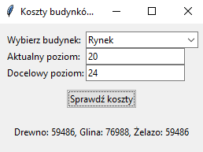

# Plemiona-Obliczanie-Kosztow-Budynkow
Program napisany jest w języku Python, który ma za zadanie obliczać ile należy wydać surowców na podane poziomy budynków.

W aplikacji należy wybrać odpowiedni budynek z listy. Następnie wprowadzamy aktualny poziom budynku oraz poziom, który chcemy osiągnąć. Program zwraca ilość surowców, którą należy wydać na zrealizowanie całego zakresu poziomów.

Dzięki tej aplikacji jesteśmy w stanie w szybszy sposób przesyłać konkretne liczby surowców bez konieczności wykonywania ręcznych obliczeń. Program zaczytuje dane z lokalnych plików ".html".

